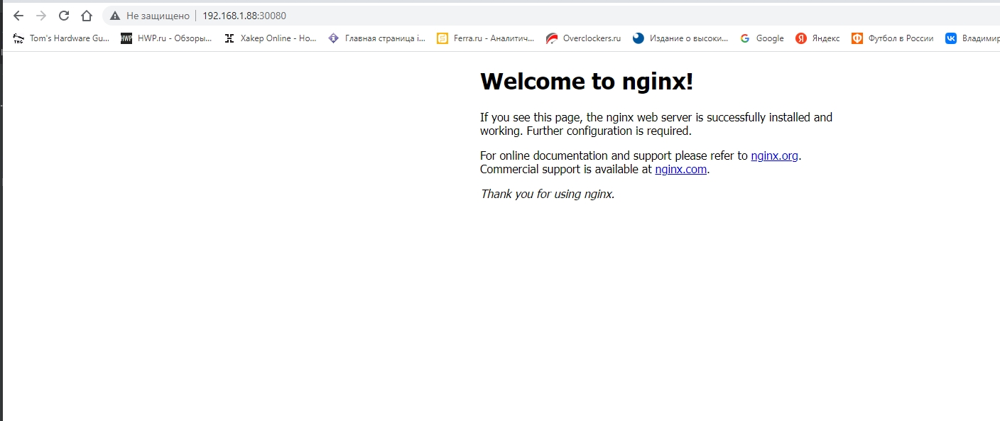
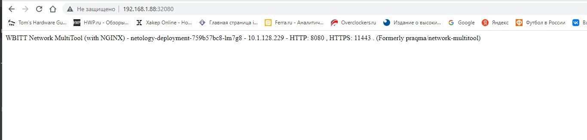

# Домашнее задание к занятию "Сетевое взаимодействие в K8S. Часть 1" dev-17_kuber-homeworks-1.4-yakovlev_vs
17_kuber-homeworks-1.4


### Цель задания

В тестовой среде Kubernetes необходимо обеспечить доступ к приложению, установленному в предыдущем ДЗ и состоящему из двух контейнеров, по разным портам в разные контейнеры как внутри кластера, так и снаружи.

------

### Чеклист готовности к домашнему заданию

1. Установленное k8s-решение (например, MicroK8S)
2. Установленный локальный kubectl
3. Редактор YAML-файлов с подключенным git-репозиторием

------

### Инструменты/ дополнительные материалы, которые пригодятся для выполнения задания

1. [Описание](https://kubernetes.io/docs/concepts/workloads/controllers/deployment/) Deployment и примеры манифестов
2. [Описание](https://kubernetes.io/docs/concepts/services-networking/service/) Описание Service
3. [Описание](https://github.com/wbitt/Network-MultiTool) Multitool

------

### Задание 1. Создать Deployment и обеспечить доступ к контейнерам приложения по разным портам из другого Pod'а внутри кластера

#### Решение

1. Создать Deployment приложения, состоящего из двух контейнеров - nginx и multitool с кол-вом реплик 3шт.

- [deployments.yaml](file/deployments.yaml)

```bash
$ kubectl get deployment
NAME                  READY   UP-TO-DATE   AVAILABLE   AGE
multitool-test        1/1     1            1           24h
myapp-pod             1/1     1            1           6d
netology-deployment   3/3     3            3           41m
```
```bash
$ kubectl describe deployment netology-deployment
Name:                   netology-deployment
Namespace:              default
CreationTimestamp:      Wed, 22 Feb 2023 21:09:30 +0300
Labels:                 app=main1
Annotations:            deployment.kubernetes.io/revision: 2
Selector:               app=main1
Replicas:               3 desired | 3 updated | 3 total | 3 available | 0 unavailable
StrategyType:           RollingUpdate
MinReadySeconds:        0
RollingUpdateStrategy:  25% max unavailable, 25% max surge
Pod Template:
  Labels:  app=main1
  Containers:
   nginx:
    Image:        nginx:1.19.1
    Port:         80/TCP
    Host Port:    0/TCP
    Environment:  <none>
    Mounts:       <none>
   network-multitool:
    Image:       wbitt/network-multitool
    Ports:       8080/TCP, 11443/TCP
    Host Ports:  0/TCP, 0/TCP
    Limits:
      cpu:     10m
      memory:  20Mi
    Requests:
      cpu:     1m
      memory:  20Mi
    Environment:
      HTTP_PORT:   8080
      HTTPS_PORT:  11443
    Mounts:        <none>
  Volumes:         <none>
Conditions:
  Type           Status  Reason
  ----           ------  ------
  Available      True    MinimumReplicasAvailable
  Progressing    True    NewReplicaSetAvailable
OldReplicaSets:  <none>
NewReplicaSet:   netology-deployment-759b57bc8 (3/3 replicas created)
Events:          <none>
```

2. Создать Service, который обеспечит доступ внутри кластера до контейнеров приложения из п.1 по порту 9001 - nginx 80, по 9002 - multitool 8080.

- [my-svc.yaml](file/my-svc.yaml)

```bash
$ kubectl get svc -o wide
NAME           TYPE        CLUSTER-IP       EXTERNAL-IP   PORT(S)             AGE     SELECTOR
kubernetes     ClusterIP   10.152.183.1     <none>        443/TCP             11d     <none>
netology-svc   ClusterIP   10.152.183.100   <none>        8080/TCP            7d21h   app=netology
nginx-svc      ClusterIP   10.152.183.128   <none>        80/TCP              7d      app=main
myservice      ClusterIP   10.152.183.230   <none>        80/TCP              6d      <none>
mysvc          ClusterIP   10.152.183.242   <none>        9001/TCP,9002/TCP   24h     app=main1
```

3. Создать отдельный Pod с приложением multitool и убедиться с помощью `curl`, что из пода есть доступ до приложения из п.1 по разным портам в разные контейнеры

- [Multitool](file/mtools.yaml)

4. Продемонстрировать доступ с помощью `curl` по доменному имени сервиса.

```bash
$ kubectl exec multitool-test-5c8cbc9b6c-ch9nz -- curl mysvc:9001
<!DOCTYPE html>
<html>
<head>
<title>Welcome to nginx!</title>
<style>
    body {
        width: 35em;
        margin: 0 auto;
        font-family: Tahoma, Verdana, Arial, sans-serif;
    }
</style>
</head>
<body>
<h1>Welcome to nginx!</h1>
<p>If you see this page, the nginx web server is successfully installed and
working. Further configuration is required.</p>

<p>For online documentation and support please refer to
<a href="http://nginx.org/">nginx.org</a>.<br/>
Commercial support is available at
<a href="http://nginx.com/">nginx.com</a>.</p>

<p><em>Thank you for using nginx.</em></p>
</body>
</html>
  % Total    % Received % Xferd  Average Speed   Time    Time     Time  Current
                                 Dload  Upload   Total   Spent    Left  Speed
100   612  100   612    0     0   377k      0 --:--:-- --:--:-- --:--:--  597k
```
```bash
$ kubectl exec multitool-test-5c8cbc9b6c-ch9nz -- curl mysvc:9002
  % Total    % Received % Xferd  Average Speed   Time    Time     Time  Current
                                 Dload  Upload   Total   Spent    Left  Speed
  0     0    0     0    0     0      0      0 --:--:-- --:--:-- --:--:--     0WBITT Network MultiTool (with NGINX) - netology-deployment-759b57bc8-4ndxq - 10.1.128.232 - HTTP: 8080 , HTTPS: 11443 . (Formerly praqma/network-multitool)
100   156  100   156    0     0  29268      0 --:--:-- --:--:-- --:--:-- 31200
```
5. Предоставить манифесты Deployment'а и Service в решении, а также скриншоты или вывод команды п.4
- [deployments.yaml](file/deployments.yaml)
- [my-svc.yaml](file/my-svc.yaml)
------

### Задание 2. Создать Service и обеспечить доступ к приложениям снаружи кластера


#### Решение

1. Создать отдельный Service приложения из Задания 1 с возможностью доступа снаружи кластера к nginx используя тип NodePort.

```bash
$ kubectl get svc
NAME           TYPE        CLUSTER-IP       EXTERNAL-IP   PORT(S)                         AGE
kubernetes     ClusterIP   10.152.183.1     <none>        443/TCP                         11d
netology-svc   ClusterIP   10.152.183.100   <none>        8080/TCP                        7d21h
nginx-svc      ClusterIP   10.152.183.128   <none>        80/TCP                          7d1h
myservice      ClusterIP   10.152.183.230   <none>        80/TCP                          6d
np-mysvc       NodePort    10.152.183.210   <none>        9001:30080/TCP,9002:32080/TCP   14s
```

2. Продемонстрировать доступ с помощью браузера или `curl` с локального компьютера.





3. Предоставить манифест и Service в решении, а также скриншоты или вывод команды п.2.

- [NodePort](file/NodePort-svc.yaml)

------

### Правила приема работы

1. Домашняя работа оформляется в своем Git репозитории в файле README.md. Выполненное домашнее задание пришлите ссылкой на .md-файл в вашем репозитории.
2. Файл README.md должен содержать скриншоты вывода необходимых команд `kubectl`, а также скриншоты результатов.
3. Репозиторий должен содержать тексты манифестов или ссылки на них в файле README.md.